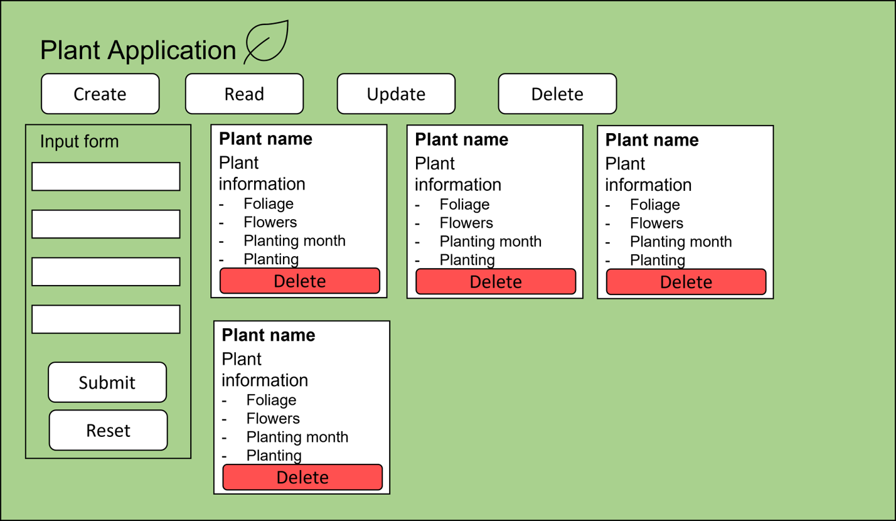
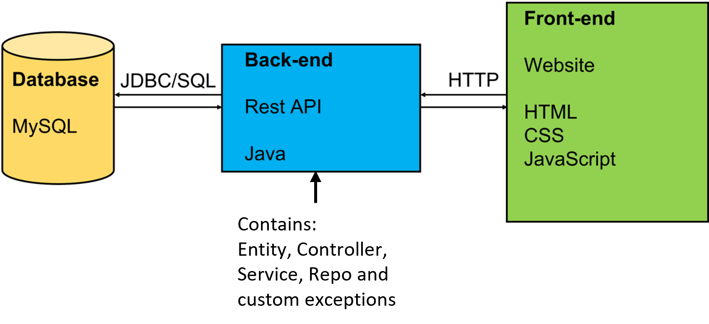
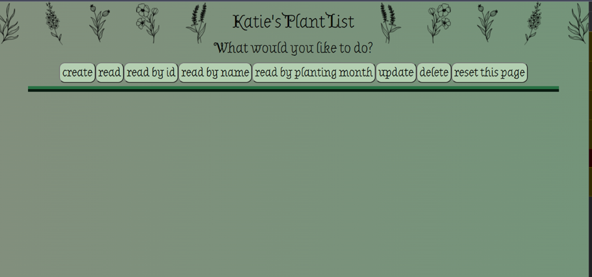
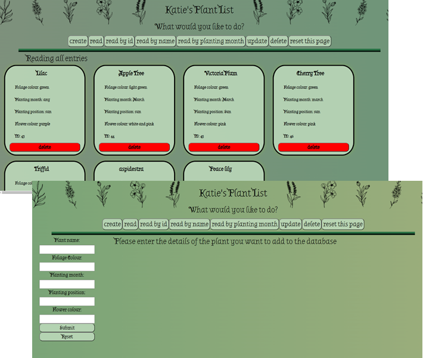
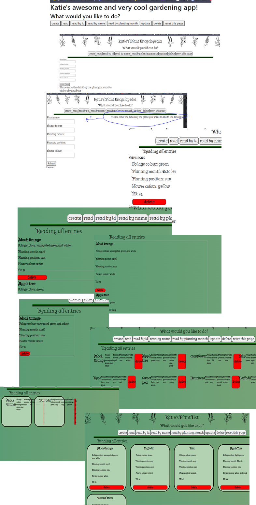

# Spring Project- Backend Readme
### Katie Diggory, December 2021

### Introduction
The objective of this project was to produce a CRUD application using supporting tools and technologies covered in the training so far.
The requirements for this application were:
- Project management: 

Jira board with user stories, use cases and tasks required
Feature branch model of version control using Git
Clear documentation
- Relational databases:

Data persistence in SQL 
H2 database for testing
- Java SE and Spring Boot:

Functional application written in Java, meeting the requirements of the Jira board
- Testing:

Acceptable level of test coverage for back-end
MockMVC, Mockito and JUnit
- Front-end development:

HTML, JavaScript and CSS

### Planning Phase

As the brief was to make a list application I chose something I was interested in, plants. Using Jira I made a scrum board with epics and user stories as well as linked issues to help me navigate producing the back-end and front-end parts of the project (figure 1). 

> figure 1: A snapshot of the Jira board showing the project epics, one of which in detail showing user stories. 

Once the Jira board was done I started to think about how the front-end would look (figure 2), I did this in powerpoint and tried to stick to it where I could, but also made changes based on how it looked whilst working. Below you can see the initial design.

> figure 2: Initial design for the front-end website

### Version control

I made 2 repositories on GitHub, one for the front-end and one for the backend. Both were linked to my Jira board for smart commits, and I used the feature branch model for both. Only merging the Dev branch into main once I was finished with the project. 

///// put in pictures of git branches - showing feature branch model. 
> figure 3: Image from GitHub showing the feature branches for the front-end of the application. 

### Databases

This project uses 2 databases, the H2 database for production and testing, and the mySQL database to store persisting data from the application (either from Spring/postman or the front-end.

    DROP TABLE IF EXISTS plants CASCADE;
    CREATE TABLE  plants (
    id INTEGER AUTO_INCREMENT, 
    flower_colour VARCHAR(255), 
    foliage_colour VARCHAR(255), 
    name VARCHAR(255), 
    planting_month VARCHAR(255), 
    planting_position VARCHAR(255), 
    PRIMARY KEY (id));
> figure 4 : Shows the contents of the SQL schema file used to create the table for testing

    insert into plants (
    flower_colour, foliage_colour, name, planting_month, planting_position)
     values 
     ('Yellow', 'green', 'Daffodil', 'October', 'sun'),
      ('Pink', 'green', 'Peony', 'October', 'sun'),
    ('Orange', 'green', 'Marigold', 'March', 'sun');
> figure 5: shows the contents of the SQL data file used to populate the plants table with data for testing

> figure 6: A diagram showing the architecture of the application
### Backend
Java and a Spring Boot framework were used to write the back-end of this project. 
As well as the basic application framework 2 custom exceptions were also written as can be seen below from figure 8 and 9. 

> figure 7: A snapshot of the PlantsController class showing the @ mapping annotations for each request and the HttpStatus that should be expected. 

> figure 8: A snapshot of the PlantsRepo class showing several custom requests that were used for the application.

> figure 9: A snapshot of one of the custom exceptions.

> figure 10: A snapshot of the PlantsService class showing some of the logic behind the requests made by the controller class. 

Before I got the front-end working I used postman to send the HTTP requests. This helped me determine whether functions were working in the back-end before I tried them in the front-end. 

### Testing
For this application both unit testing and integration testing was done. Overall it has ~81% test coverage (see figure 11).
MockMVC was used for integration testing (figure 12) and JUnit/Mockito was used for the unit testing (figure 13)

> figure 11: A snapshot showing test coverage of the back-end application. 

> figure 12: A snapshot showing MockMVC testing of the controller class.

> figure 13: A snapshot showing JUnit/Mockito testing of the service class (This was also used for testing the custom exceptions).

### Front-end
The front-end of the application is written using HTML, CSS and JavaScript. The bootstrap framework was used to create cards.

> figure 14: A snapshot of the final website, showing before any options are selected

> figure 15: A snapshot of the final website after read all and create are selected

JavaScript was used for the front-end logic. It was used to create the input forms when create, update and search functions were selected, as well as interacting with the back-end when needed. 

The final website went through a lot of iterations before I was happy with the final one (figure 14-15), below are some of the evolutionary stages of the front-end(figure 16).

> figure 16: Evolution of the website throughout the project week, showing in particular the difficulties faces with getting the bootstrap cards to behave as desired. 

### Continued Development
If I were to have more time to develop the application further I would focus on:
- Making the update function show the updated plant after clicking submit, instead of saying updated.
- Having the website look more professional
- I would create a modal in boot-strap with an are you sure warning for the delete function. 

